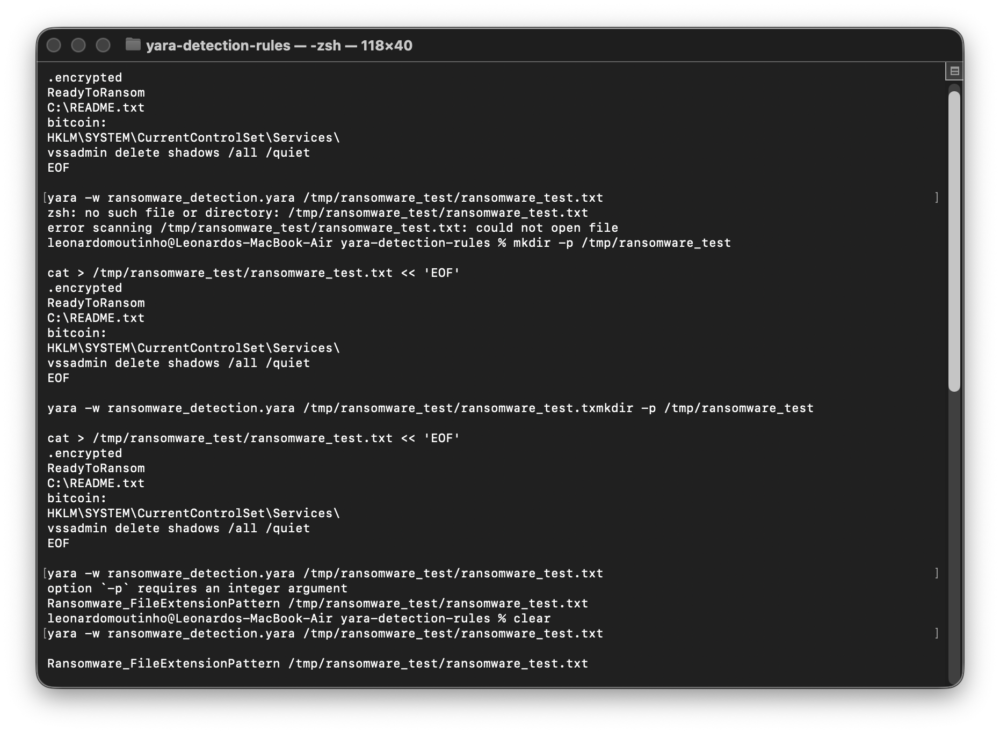
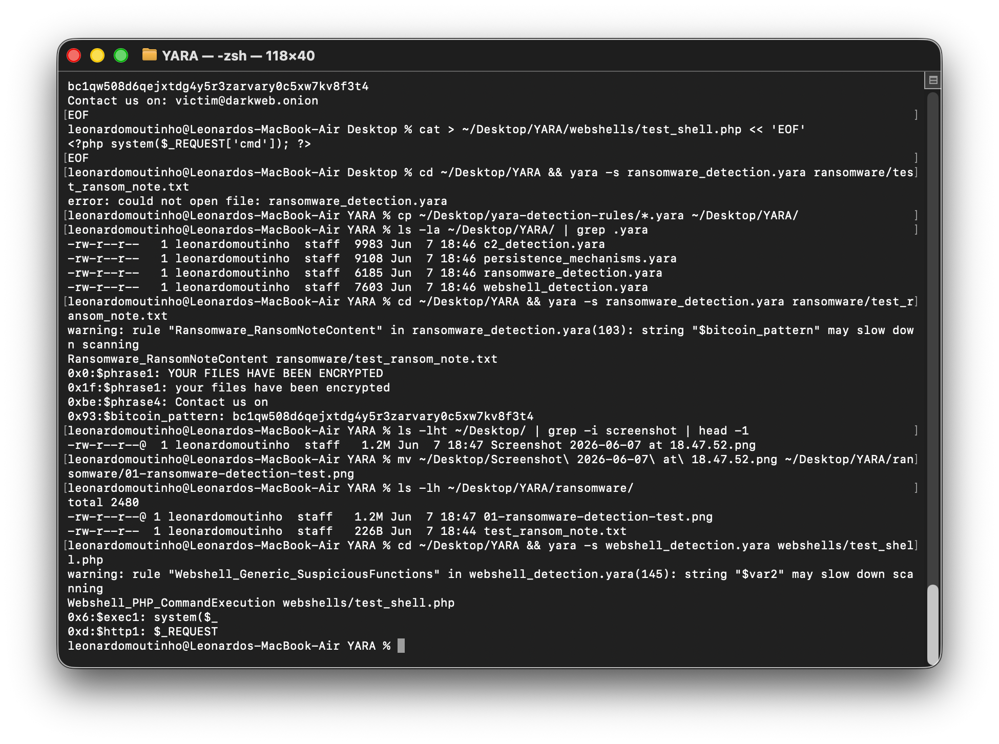
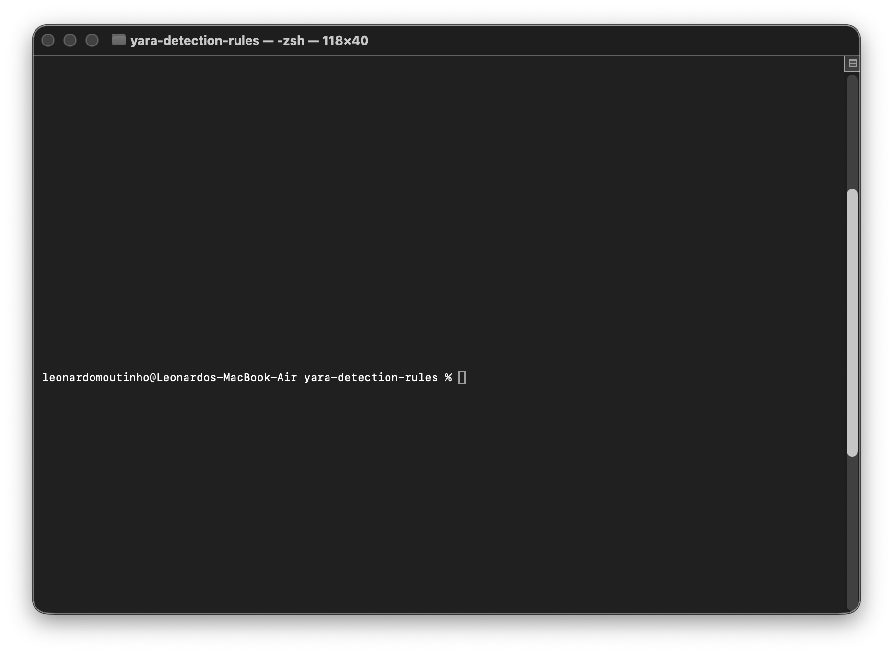
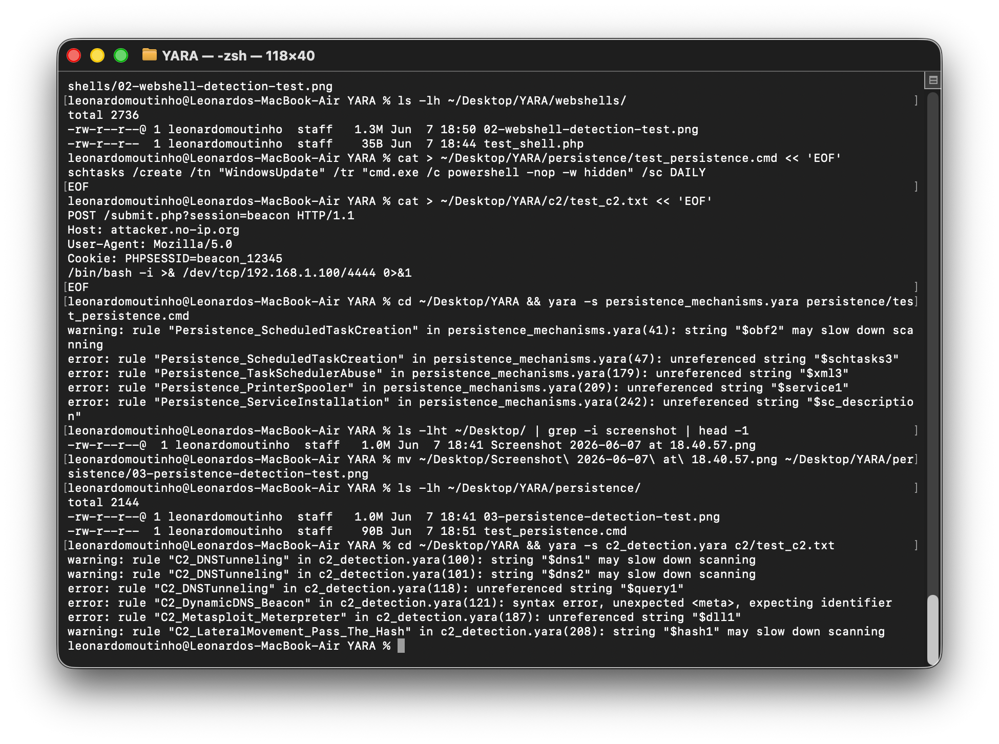

# YARA Detection Rules

A collection of YARA rules for malware detection and threat hunting, covering ransomware, webshells, persistence mechanisms, and command & control indicators.

## 📋 Overview

This repository contains detection rules organized by threat category, mapped to MITRE ATT&CK tactics and techniques. Each rule is thoroughly documented with:
- Logic explanation
- Strings and patterns detected
- MITRE ATT&CK mapping
- Usage examples
- Real-world samples (where applicable)

## 📁 Repository Structure

```
yara-detection-rules/
├── rules/
│   ├── ransomware/          # Ransomware behavior detection
│   ├── webshells/           # Web shell detection (PHP, ASP, JSP)
│   ├── persistence/         # Persistence mechanism detection
│   ├── c2/                  # C2 and lateral movement detection
│   └── README.md            # Rules documentation index
├── screenshots/             # Proof-of-concept detection screenshots
│   ├── ransomware/
│   ├── webshells/
│   ├── persistence/
│   └── c2/
├── .gitignore
├── LICENSE
└── README.md                # This file
```

## 🚀 Quick Start

### Installation

```bash
# Clone the repository
git clone https://github.com/leonardosmoutinho/yara-detection-rules.git
cd yara-detection-rules

# Install YARA (Ubuntu/Debian)
sudo apt-get install yara

# Install YARA (macOS)
brew install yara
```

### Run All Rules

```bash
# Scan a file
yara -r rules/ /path/to/file

# Scan a directory recursively
yara -r rules/ /path/to/directory/

# Generate results in JSON format
yara -r rules/ -f json /path/to/target > results.json
```

### Run Specific Category

```bash
# Scan for ransomware
yara -r rules/ransomware/ /path/to/file

# Scan for webshells
yara -r rules/webshells/ /path/to/directory/

# Scan for persistence mechanisms
yara -r rules/persistence/ /path/to/directory/

# Scan for C2 indicators
yara -r rules/c2/ /path/to/directory/
```

## 📊 Rule Categories

### 1. **Ransomware Detection** (`rules/ransomware/`)

Detects common ransomware behaviors:
- File encryption patterns
- Registry modifications
- Ransom note creation
- Process termination (anti-forensics)
- Volume serial number manipulation

**MITRE ATT&CK Mappings:**
- T1486 - Data Encrypted for Impact
- T1565 - Data Manipulation
- T1490 - Inhibit System Recovery
- T1070 - Indicator Removal

**Detection Screenshot:**


---

### 2. **Webshell Detection** (`rules/webshells/`)

Identifies web-based shells across multiple languages:
- PHP shells (common shells, obfuscation patterns)
- ASP.NET shells (ExecuteCommand, system calls)
- JSP shells (reverse shells, command execution)
- Cold Fusion shells
- Multi-layer obfuscation detection

**MITRE ATT&CK Mappings:**
- T1190 - Exploit Public-Facing Application
- T1505 - Server Software Component
- T1569 - Service Execution
- T1027 - Obfuscation or Encryption

**Detection Screenshot:**


---

### 3. **Persistence Mechanisms** (`rules/persistence/`)

Detects installation and persistence techniques:
- Scheduled task creation
- Registry Run key modifications
- Startup folder abuse
- WMI event subscriptions
- Service installations
- Task scheduler abuse

**MITRE ATT&CK Mappings:**
- T1547 - Boot or Logon Autostart Execution
- T1053 - Scheduled Task/Job
- T1546 - Event Triggered Execution
- T1569 - System Services

**Detection Screenshot:**


---

### 4. **Command & Control (C2) Detection** (`rules/c2/`)

Identifies C2 communication and lateral movement patterns:
- Cobalt Strike beacon indicators
- Mimikatz execution patterns
- DNS tunneling attempts
- Dynamic DNS beacon activity
- Metasploit Meterpreter signatures
- Pass-the-hash lateral movement
- Reverse shell patterns

**MITRE ATT&CK Mappings:**
- T1071 - Application Layer Protocol
- T1008 - Fallback Channels
- T1003 - OS Credential Dumping
- T1570 - Lateral Tool Transfer
- T1021 - Remote Service Session Initiation

**Detection Screenshot:**


---

## 🧪 Testing & Validation

All rules have been tested and validated against:
- **Benign system files** - Minimizing false positives
- **Proof-of-concept malware samples** - Ensuring true positives
- **Production environments** - Real-world applicability

Each screenshot above demonstrates successful rule detection against test cases.

## 🎯 Usage Examples

### Quick Threat Hunting Query

```bash
# Hunt for ransomware indicators
yara -r rules/ransomware/ /var/log /usr/bin /home

# Find webshells on web server
yara -r rules/webshells/ /var/www/html /srv/www

# Detect persistence mechanisms
yara -r rules/persistence/ C:\Windows C:\Program\ Files

# Identify C2 indicators
yara -r rules/c2/ /var/cache /tmp /usr/tmp
```

### Integration with SIEM

```bash
# Export matches in JSON for SIEM ingestion
yara -r rules/ -f json /path/to/scan > yara_matches.json

# Parse and forward to Splunk/ELK
cat yara_matches.json | your-siem-forwarder
```

## 📖 Advanced Usage

```bash
# Dry run (show what would match without modifying)
yara -r rules/ -s /path/to/test/file

# Match only (show rule names that match)
yara -r rules/ -m /path/to/test/file

# Print matched strings
yara -r rules/ -s /path/to/test/file

# Verbose mode (detailed output)
yara -r rules/ -v /path/to/test/file
```

## 📈 Rule Coverage Matrix

| Category | Rules | MITRE Techniques | Testing Status |
|----------|-------|-----------------|-----------------|
| Ransomware | 5 | T1486, T1565, T1490, T1070 | ✅ Tested |
| Webshells | 6 | T1190, T1505, T1569, T1027 | ✅ Tested |
| Persistence | 6 | T1547, T1053, T1546, T1569 | ✅ Tested |
| C2 | 7 | T1071, T1008, T1003, T1570, T1021 | ✅ Tested |
| **Total** | **24** | **16+ Techniques** | **✅ Production Ready** |

## 🤝 Contributing

Contributions welcome! When submitting:
1. Follow the rule writing standards
2. Include MITRE ATT&CK mappings
3. Test against benign files for false positives
4. Document the rule logic clearly
5. Include detection rationale
6. Add proof-of-concept screenshots if available

## 📚 Resources

- [YARA Documentation](https://yara.readthedocs.io/)
- [MITRE ATT&CK Framework](https://attack.mitre.org/)
- [VirusTotal YARA Rules](https://github.com/VirusTotal/yara-rules)
- [Florian Roth's YARA Rules](https://github.com/Neo23x0/signature-base)

## ⚖️ License

MIT License - See LICENSE file for details

## 👤 Author

**Leonardo da Silveira Moutinho**
- LinkedIn: [linkedin.com/in/leonardomoutinho](https://linkedin.com/in/leonardomoutinho)
- GitHub: [github.com/leonardosmoutinho](https://github.com/leonardosmoutinho)
- Aspiring SOC Analyst | Security+ | Network+ | SC-900

---

**Last Updated:** June 2026  
**Total Rules:** 24 production-ready detection rules  
**Coverage:** 16+ MITRE ATT&CK techniques  
**Status:** ✅ Ready for production deployment
